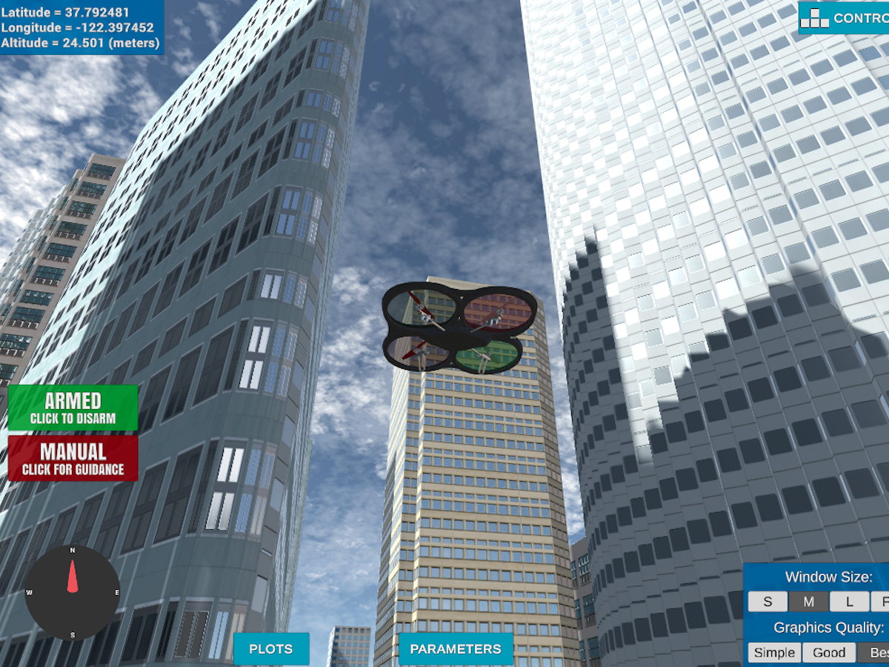
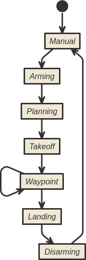
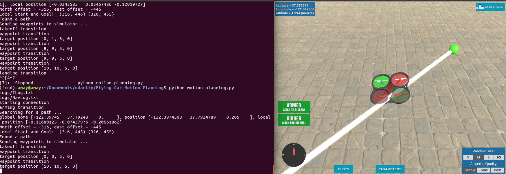
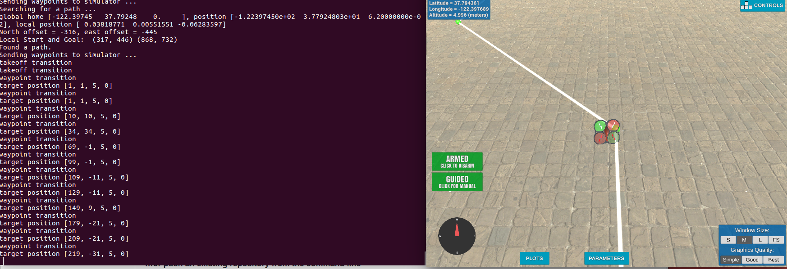
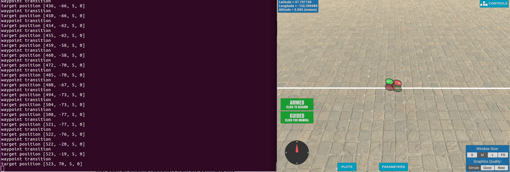

## Project: 3D Motion Planning


---


# Required Steps for a Passing Submission:
1. Load the 2.5D map in the colliders.csv file describing the environment.
2. Discretize the environment into a grid or graph representation.
3. Define the start and goal locations.
4. Perform a search using A* or other search algorithm.
5. Use a collinearity test or ray tracing method (like Bresenham) to remove unnecessary waypoints.
6. Return waypoints in local ECEF coordinates (format for `self.all_waypoints` is [N, E, altitude, heading], where the drone’s start location corresponds to [0, 0, 0, 0].
7. Write it up.
8. Congratulations!  Your Done!

## [Rubric](https://review.udacity.com/#!/rubrics/1534/view) Points
### Here I will consider the rubric points individually and describe how I addressed each point in my implementation.  

---
### Writeup / README

#### 1. Provide a Writeup / README that includes all the rubric points and how you addressed each one.  You can submit your writeup as markdown or pdf.  

You're reading it! Below I describe how I addressed each rubric point and where in my code each point is handled.

### Explain the Starter Code

#### 1. Explain the functionality of what's provided in `motion_planning.py` and `planning_utils.py`

`motion_planning.py` is implemented with a event-driven based on a finite state automated machine code similar to `backyard_flyer.py`. A Planning state is added to automatically generate waypoints in `motion_planning.py` which is hardcoded in `backyard_flyer.py`. 

The new `PLANNING` state comes between `ARMING` and `TAKEOFF`. When the drone is at the state ARMING and it is actually armed state_callback method and the transition to PLANNING is executed on the method plan_path. This method responsibility is to calculate the waypoints necessary for the drone to arrive at its destination.



Diagram http://www.nomnoml.com/ : 
[<start>start]->[<abstract>Manual]
[<abstract>Manual]->[<abstract>Arming]
[<abstract>Arming]->[<abstract>Planning]
[<abstract>Planning]->[<abstract>Takeoff]
[<abstract>Takeoff]->[<abstract>Waypoint]
[Waypoint]->[Waypoint]
[<abstract>Waypoint]->[<abstract>Landing]
[<abstract>Landing]->[<abstract>Disarming]
[<abstract>Disarming]->[Manual]

The `planning_utils.py` contains all the classes and functions required for path planning. The most significant method that it contains is `a_star()` which lets us route the drone to it's goal. The A* graph search algorithm is like the djikstra's shortest path algo but Heuristic in nature and not greedy. Needless to say if `planning_utils.py` contains the A* algo then it also contains the graph creation which is encapsulated in the `create_grid()` function.

##### `plan_path()` method:

- The `colliders.csv` file is loaded and in it we get all the info of the map, starting point etc.
- The grid is calculated using the `create_grid()` function from `planning_utils.py`.
- We get the home position and get the local north and local east and local down by passing the global position and global home to `global_to_local()` function.
- The grid_start is calculated by taking the difference of local_north and north offset and local east and east offset.
- The goal grid is set 10 north and east from local position.
- If we get goal grids in the command line then we set those for the grid goal.
- To calculate the best path forward to the goal we use the `a_star()` function from `planning_utils.py`.
- Once we get the path we use the colliearity function to normalize the path. 
- The waypoints are generated and sent to the simulator using the `send_waypoints()` function.

### Implementing Your Path Planning Algorithm

#### 1. Set your global home position

The `colliders.csv` file already contains the home latitude and longitude position we can easily read the 1st line and use the values to set the global home position using `self.set_home_position()` function.

#### 2. Set your current local position

Current local position can be calculated from current global position `self.global_position` and global home `self.global_home` with `global_to_local()` function.

#### 3. Set grid start position from local position

This local position is something we already have in `self.local_position` we just use the latitude and longitude in it to obtain grid start.

#### 4. Set grid goal position from geodetic coords

The grid goal position may be set with command line arguments.

```shell
python motion_planning.py --goal_lon -100.0 --goal_lat 0.0 --goal_alt 10.0
```
All these value has been made optional.

This step is to add flexibility to the desired goal location. Should be able to choose any (lat, lon) within the map and have it rendered to a goal location on the grid.

#### 5. Modify A* to include diagonal motion (or replace A* altogether)

provided A* algorithm allows only horizontal or diagnoal motion; so I have extended it to include diagonal directions. The Action enum in `planning_utils.py` only carried the 4 Primary Cardinal directions namely  north, east, south, and west; I extend it to be the 8 Secondary Cardinal directions which meant adding north-east, north-west, south-east and south-west. I also extended the valid actions to include the diagonal movements. The cost of diagonal movements is root of 2 based on the pythagoras theorem.

#### 6. Cull waypoints 


I have pruned the path using collinearity with the method provided by the lectures. If three consecutive points in the path have a very small deviation then I have removed the middle point from the path. I calculate the deviant using the useful numpy determinant method `np.linalg.det()`; if the determinant is smaller than 0.00001 then the midpoint is not worth considering.


### Execute the flight
#### 1. Does it work?
It works!





